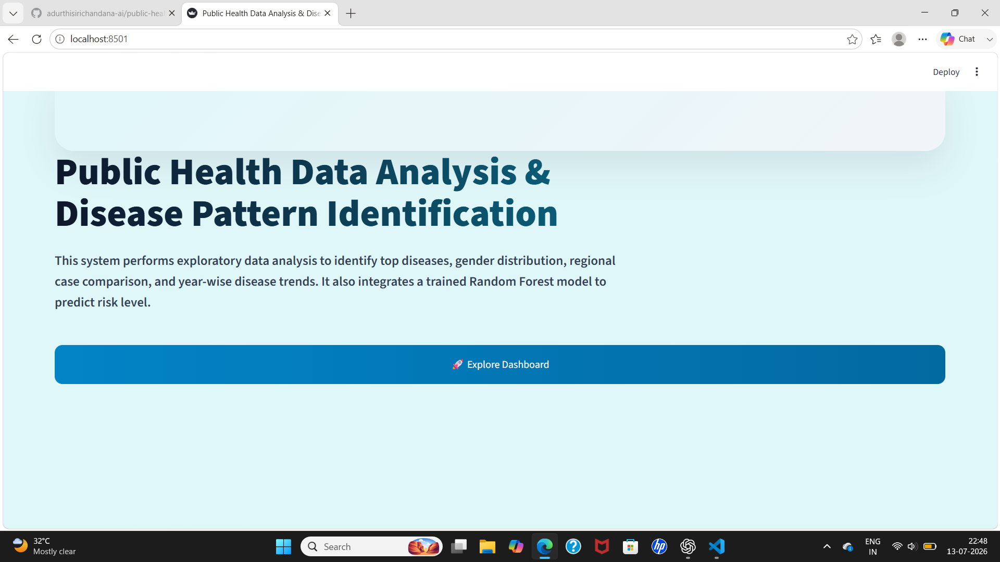
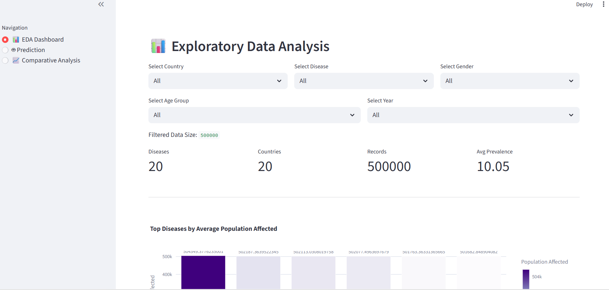
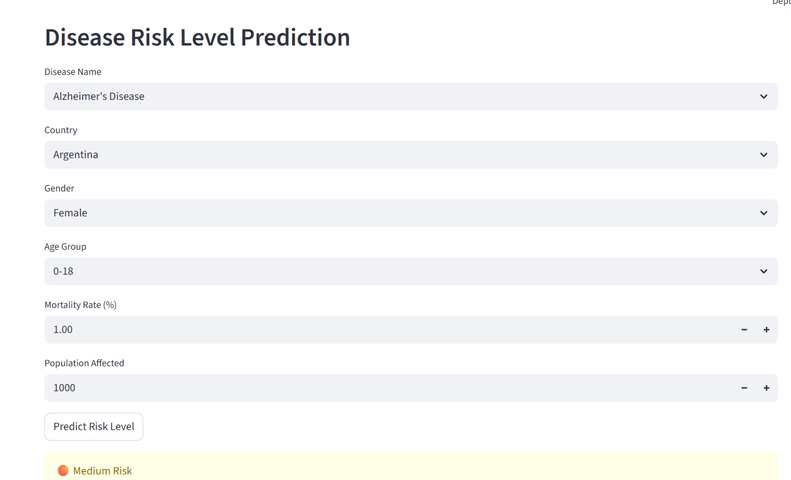
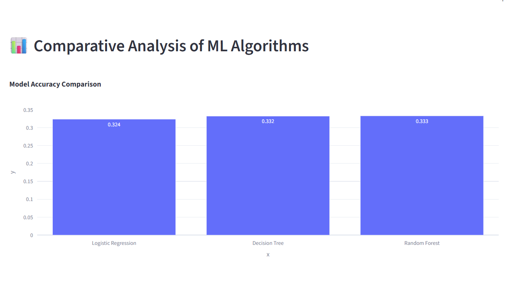

# 🏥 Public Health Data Analysis for Disease Pattern Identification


## 📖 About the Project

Public Health Data Analysis for Disease Pattern Identification is an end-to-end Machine Learning project developed using Python and Streamlit.

The main objective of this project is to analyze global health data, identify disease patterns, and predict disease risk levels using machine learning techniques.

The project combines Exploratory Data Analysis (EDA), interactive visualizations, and predictive analytics to help understand disease trends across different countries, age groups, and genders.

This project was developed as my final-year B.Tech project and demonstrates the complete machine learning workflow, including data preprocessing, feature engineering, model training, model evaluation, and deployment through an interactive Streamlit application.

---

## 🎯 Problem Statement

Public health organizations generate massive amounts of disease-related data every year. However, extracting meaningful insights from this data and identifying disease patterns manually is time-consuming and difficult.

This project aims to analyze global health statistics to identify disease trends across countries, age groups, and genders. In addition to data analysis, the project uses machine learning to predict disease risk levels, helping users understand the severity of different health conditions based on selected features.

The project integrates data analysis, visualization, and predictive modeling into a single interactive Streamlit application.

---

## ✨ Features

- 📊 Interactive Exploratory Data Analysis (EDA)
- 🌍 Country-wise disease analysis
- 👨‍👩‍👧 Gender distribution analysis
- 👶 Age group analysis
- 📈 Disease trend visualization over years
- 🌎 Global disease distribution using an interactive world map
- 🤖 Disease Risk Level Prediction using Machine Learning
- 📊 Comparative analysis of multiple machine learning algorithms
- 🎨 User-friendly Streamlit dashboard

---

# 🛠️ Technology Stack

This project was developed using the following technologies:

| Category | Technology |
|----------|------------|
| Programming Language | Python 3 |
| Data Analysis | Pandas, NumPy |
| Machine Learning | Scikit-learn |
| Handling Imbalanced Data | SMOTE (imbalanced-learn) |
| Model Serialization | Pickle |
| Data Visualization | Plotly Express, Plotly Graph Objects |
| Web Application | Streamlit |
| Dataset | Global Health Statistics Dataset |
| Version Control | Git & GitHub |

---

# 📊 Dataset Information

This project uses the **Global Health Statistics Dataset** for analyzing disease trends and predicting disease risk levels.

### Dataset Summary

- 📌 **Dataset Name:** Global Health Statistics Dataset
- 📌 **Original Dataset Size:** 1,000,000 records
- 📌 **Training Sample Used:** 200,000 records
- 📌 **Total Features in Dataset:** 22
- 📌 **Features Used for Model Training:** 6
- 📌 **Target Variable:** Risk Level (Low, Medium, High)

### Selected Features

- Disease Name
- Country
- Gender
- Age Group
- Mortality Rate (%)
- Population Affected

### Target Classes

- 🟢 Low Risk
- 🟠 Medium Risk
- 🔴 High Risk

The **Risk Level** was created from the **Prevalence Rate (%)** column and used as the target variable for machine learning prediction.

To prevent **target leakage**, the prevalence-related feature was excluded from the training data while building the machine learning model.

# 🧠 Machine Learning Workflow

The machine learning pipeline followed in this project consists of the following steps:

### 1️⃣ Data Collection
- Loaded the **Global Health Statistics Dataset** using Pandas.
- Selected only the relevant features required for disease risk prediction.

### 2️⃣ Data Preprocessing
- Removed unnecessary columns.
- Selected important features:
  - Disease Name
  - Country
  - Gender
  - Age Group
  - Mortality Rate (%)
  - Population Affected
- Created a new target variable called **Risk Level** based on the **Prevalence Rate (%)**.

### 3️⃣ Feature Encoding
Since machine learning models cannot understand text values directly, categorical features were converted into numerical values using **LabelEncoder**.

The following columns were encoded:
- Disease Name
- Country
- Gender
- Age Group

### 4️⃣ Handling Class Imbalance
The dataset contained an unequal distribution of risk classes.

To overcome this issue, **SMOTE (Synthetic Minority Over-sampling Technique)** was applied only to the training dataset to balance the classes.

### 5️⃣ Train-Test Split
The dataset was divided into:
- **80% Training Data**
- **20% Testing Data**

A stratified train-test split was used to maintain equal class distribution.

### 6️⃣ Model Training
Three machine learning algorithms were trained and evaluated:

- Logistic Regression
- Decision Tree Classifier
- Random Forest Classifier

### 7️⃣ Model Evaluation
Each model was evaluated using:

- Accuracy
- Macro F1-Score
- Macro Recall

### 8️⃣ Best Model Selection
The model with the highest accuracy was automatically selected.

Among all models, **Random Forest** achieved the best overall performance and was chosen as the final prediction model.

### 9️⃣ Model Saving
The trained model and label encoders were saved using **Pickle** for deployment in the Streamlit application.

The following files were generated:

- model.pkl
- disease_encoder.pkl
- country_encoder.pkl
- gender_encoder.pkl
- age_encoder.pkl
- model_results.pkl

### 🔟 Streamlit Deployment
The saved model was integrated into a Streamlit web application that allows users to:

- Explore disease trends through interactive dashboards.
- Predict disease risk levels.
- Compare the performance of different machine learning models.

---

# 📈 Model Performance

Three machine learning algorithms were trained and evaluated using Accuracy, Macro F1-Score, and Macro Recall.

| Machine Learning Model | Accuracy | Macro F1-Score | Macro Recall |
|-------------------------|---------:|---------------:|-------------:|
| Logistic Regression | 32.36% | 31.92% | 32.76% |
| Decision Tree | 33.21% | 33.13% | 33.15% |
| Random Forest | **33.28%** | **33.23%** | **33.25%** |

# 📌 Results

The Random Forest model achieved the highest accuracy among the evaluated models.

The Streamlit application successfully allows users to:

- Explore disease trends
- Visualize health statistics
- Predict disease risk levels
- Compare machine learning models


### Final Model Selection

Among the evaluated machine learning models, **Random Forest** achieved the highest accuracy and was selected as the final prediction model.

Although the prediction accuracy is relatively low, the project successfully demonstrates the complete machine learning workflow, including data preprocessing, feature engineering, handling class imbalance using SMOTE, model comparison, evaluation, and deployment through a Streamlit web application.

# 📂 Project Structure

```
public_health_project/
│
├── data/
│   └── Global Health Statistics.csv
│
├── models/
│   ├── model.pkl
│   ├── disease_encoder.pkl
│   ├── country_encoder.pkl
│   ├── gender_encoder.pkl
│   ├── age_encoder.pkl
│   └── model_results.pkl
│
├── analysis.py
├── app.py
├── requirements.txt
├── README.md
└── .gitignore
```

# ⚙️ Installation

### 1. Clone the repository

```bash
git clone https://github.com/adurthisirichandana-ai/public-health-disease-pattern-analysis.git
```

### 2. Navigate to the project folder

```bash
cd public-health-disease-pattern-analysis
```

### 3. Install the required libraries

```bash
pip install -r requirements.txt
```

# 🚀 How to Run

### Step 1

Train the machine learning model

```bash
python analysis.py
```

This will generate the trained model and encoder files inside the **models/** folder.

### Step 2

Launch the Streamlit application

```bash
streamlit run app.py
```

After running the command, open the URL displayed in the terminal (usually http://localhost:8501).

---

---

# 📸 Dashboard Screenshots

The application contains four major modules:

### 🏠 Home Page
> *(Add a screenshot here after uploading your project to GitHub.)*

### 📊 Exploratory Data Analysis Dashboard
> *(Add a screenshot here.)*

### 🤖 Disease Risk Prediction
> *(Add a screenshot here.)*

### 📈 Comparative Analysis
> *(Add a screenshot here.)*

# 🔮 Future Improvements

The following enhancements can be implemented in future versions of this project:

- Improve prediction accuracy using advanced machine learning and deep learning algorithms.
- Deploy the application on Streamlit Community Cloud.
- Integrate real-time healthcare datasets.
- Add user authentication for secure access.
- Include additional health indicators for better disease risk prediction.
- Build REST APIs for integration with healthcare systems.
- Improve dashboard performance for handling larger datasets.

---

# 👩‍💻 About the Author

## Adurthi Siri Chandana

I am a recent B.Tech graduate with a strong interest in **Data Analytics, Machine Learning, Python, SQL, Power BI, and Data Visualization**.

This project was developed as my final-year B.Tech project to strengthen my practical understanding of data analysis, machine learning workflows, and interactive dashboard development.

I enjoy building real-world data analytics projects and continuously improving my technical skills by learning modern tools and technologies.

### Skills

- Python
- SQL
- Machine Learning
- Streamlit
- Pandas
- NumPy
- Scikit-learn
- Plotly
- Git & GitHub

# 🙏 Acknowledgements

This project was developed as part of my final-year B.Tech project.

During the development process, I referred to official documentation and educational resources to improve my understanding of machine learning, data analysis, and Streamlit application development.

Helpful learning resources included:

- Scikit-learn Documentation
- Streamlit Documentation
- Pandas Documentation
- Kaggle (for dataset exploration and learning)
- OpenAI ChatGPT (for learning concepts, debugging, and improving code)

All implementation, customization, testing, and project integration were completed by me.

# 📄 License

This project is intended for educational and portfolio purposes.

# ⭐ Support

If you found this project useful, consider giving this repository a ⭐ on GitHub.
---

# 📷 Application Screenshots

## 🏠 Home Page



---

## 📊 EDA Dashboard



---

## 🤖 Prediction Page



---

## 📈 Comparative Analysis

